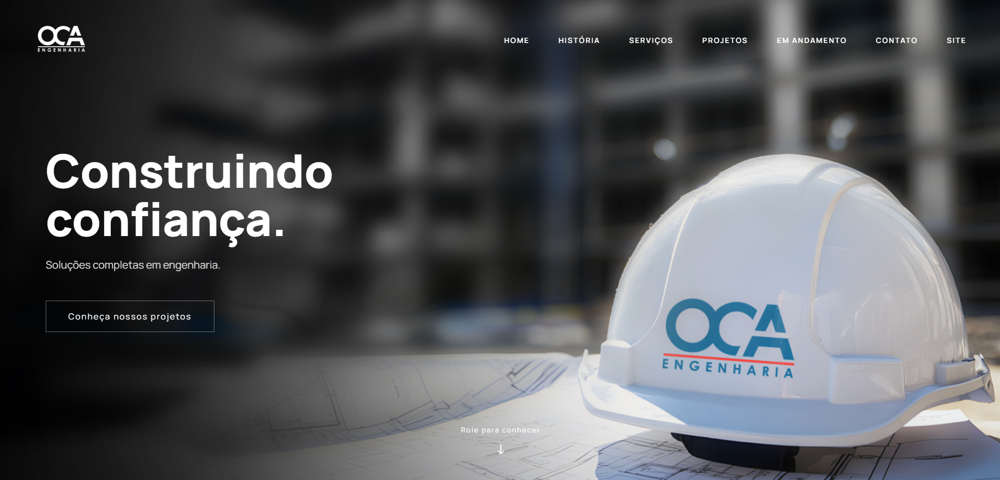

# 🏗️ OCA Engenharia — Portfólio Digital

## 📌 Sobre o Projeto

Este projeto foi desenvolvido para a **OCA Engenharia**, uma empresa especializada em engenharia civil, sistemas de prevenção contra incêndio e execução de obras corporativas.

O objetivo foi criar uma experiência digital moderna, apresentando os principais projetos da empresa de forma visual, imersiva e intuitiva, valorizando a qualidade técnica das obras realizadas.

O portfólio foi pensado para funcionar como uma apresentação comercial online, permitindo que clientes e parceiros conheçam a trajetória da empresa, seus cases e diferenciais através de uma navegação fluida e responsiva.

---

## 🚀 Acesse o Projeto

🔗 **Site publicado:**  
https://portfolio.ocaengenharia.com

---

## ✨ Principais Características

- Interface moderna e responsiva
- Apresentação de projetos através de cases
- Experiência visual com imagens em alta resolução
- Animações suaves durante a navegação
- Layout adaptado para desktop, tablet e mobile
- Foco em storytelling visual das obras
- Estrutura otimizada para apresentação comercial

---

## 🎨 Design & Experiência

O projeto foi desenvolvido com foco em:

- **Design minimalista e sofisticado**
- Hierarquia visual clara
- Navegação intuitiva
- Valorização das imagens das obras
- Sensação de imersão através de transições e movimentos suaves

A proposta foi transformar um portfólio tradicional em uma experiência digital capaz de transmitir a grandiosidade e o cuidado presente em cada projeto executado pela OCA Engenharia.

---

## 🛠️ Tecnologias Utilizadas

- HTML5
- CSS3
- JavaScript
- Animações e efeitos de interação
- Responsividade Mobile First
- GitHub Pages / Cloud Hosting

---

## 📂 Estrutura do Projeto

---

## 📸 Projetos Apresentados

O portfólio apresenta obras e projetos desenvolvidos pela OCA Engenharia, incluindo:

- Obras corporativas
- Reformas e retrofit
- Sistemas de prevenção contra incêndio
- Projetos industriais e comerciais

---

## 👨‍💻 Desenvolvimento

Projeto desenvolvido por:

**Rodrigo Sein — Rsein Estúdio**

Product Designer | Front-end Developer | Motion Designer

🔗 Instagram:
https://instagram.com/rseinestudio

---

## 📄 Licença

Este projeto foi desenvolvido exclusivamente para apresentação institucional da OCA Engenharia.

© OCA Engenharia

